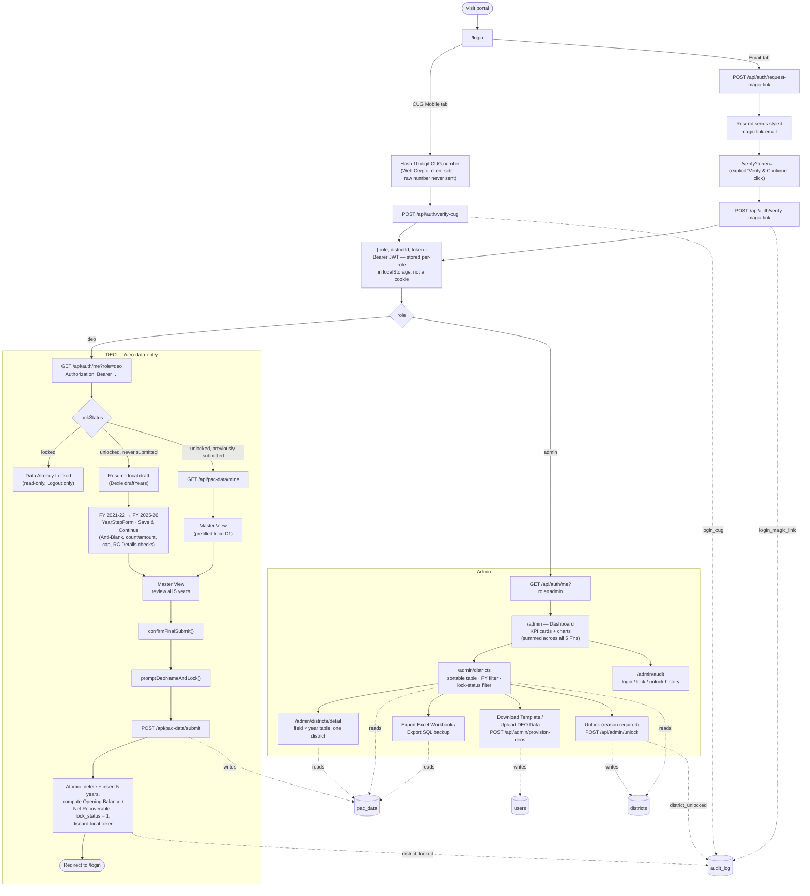

# Excise Revenue Recovery Portal

Internal portal for the Department of Excise, Government of Uttar Pradesh, to collect
5 years of historical PAC (Recovery Certificate) data — FY 2021-22 to FY 2025-26 — across
all 75 districts.

## Architecture

Two completely decoupled apps, deployed as separate Cloudflare resources:

| Directory   | What it is                                                              | Deploys to              |
| ----------- | ------------------------------------------------------------------------ | ------------------------ |
| `/frontend` | Next.js App Router, `output: "export"` — behaves as a static SPA        | Cloudflare Pages         |
| `/api`      | Next.js App Router, native `app/api/**/route.ts` only (no Hono/Express) | Cloudflare Worker (via [OpenNext](https://opennext.js.org/cloudflare)) + D1 |

They talk over plain `fetch`, cross-origin, authenticated via a Bearer token rather than a
cookie (see [CLAUDE.md](./CLAUDE.md) for the CORS/auth setup and why). There is no shared
package — types that overlap (financial years, PAC field order) are intentionally duplicated in
each app.

Client-side libraries (SweetAlert2, SheetJS, Tabler Icons, Google Fonts, Tailwind CSS v4,
Chart.js) load from the jsDelivr CDN in `frontend/app/layout.tsx` rather than being bundled —
see that file. SweetAlert2/SheetJS/Chart.js are still listed as npm `devDependencies` purely
for their TypeScript types (`frontend/lib/globals.d.ts`'s `window.Swal`/`XLSX`/`Chart`), not
because they're actually bundled. Cleave.js and TanStack Table are real npm dependencies,
since they need to hook into React render/event cycles rather than run as passive globals.

## Data model (`api/db/schema.ts`)

- **`districts`** — one row per district (75 total, seeded from `api/drizzle/seed.sql`):
  `id`, `district_name`, `lock_status` (0/1), `unlocked_at`, `unlock_reason`, `unlocked_by`
  (most recent unlock event only — full history is in `audit_log`).
- **`users`** — DEOs and Admins: `id`, `role` (`deo`/`admin`), `email`, `cug_hash` (SHA-256 of a
  10-digit CUG mobile number), `district_id`, `locked_at`, `submitted_by_name`, `created_at`.
- **`magic_link_tokens`** — Admin login tokens: `id`, `user_id`, `token`, `expires_at`,
  `used_at`. Never leaves the API — not cached client-side, not part of the SQL backup export.
- **`pac_data`** — one row per `(district_id, financial_year)`, unique-indexed. Six DEO-entered
  fields per year, in this order (numbered 2–5 to match the government form; Opening Balance is
  "1.", computed, and always shown first):

  | Field             | Hindi label                                                                 | Type    |
  | ----------------- | ---------------------------------------------------------------------------- | ------- |
  | `grossArrears`    | 2. सकल बकाया धनराशि (मूल धन + ब्याज) — Gross Arrears (Principal + Interest)   | money   |
  | `rcCount`         | 3. (i) जारी आर.सी. (R.C.) की संख्या — No. of RCs Issued                      | integer |
  | `rcAmount`        | 3. (ii) आर.सी. में निहित धनराशि                                              | money   |
  | `recoveredAmount` | 4. वसूल की गयी धनराशि                                                       | money   |
  | `stayCount`       | 5. (i) स्थगन आदेशों की संख्या — No. of Stay Orders                           | integer |
  | `stayAmount`      | 5. (ii) सक्षम न्यायालय द्वारा स्थगित धनराशि                                  | money   |

  Plus `rc_details` — a JSON-stringified array of `{ rcNumber, rcAmount, stayed }`, the per-RC
  breakdown behind `rcCount`/`rcAmount` above (row count must equal `rcCount`, entries must sum
  to `rcAmount` — see `api/lib/rc-details.ts`'s `validateRcDetails()`). Independent of
  `recoveredAmount`/`stayAmount`/the computed columns below — an RC informs a defaulter what
  they owe, for any amount, regardless of what's actually recovered; `stayed` (a court staying
  this specific RC) is a different concept from the aggregate Stay Count/Stay Amount fields (a
  court staying recovery of an amount). Two computed columns, `opening_balance` and
  `net_recoverable` (see "Net Recoverable" below), and `submitted_by_name`/`locked_at`,
  duplicated from `users` onto the row itself so Admin views can show "locked by X on Y" without
  a join. `financial_year` is one of `"2021-22" .. "2025-26"` (`FINANCIAL_YEARS`). Standard `id`
  primary key and a `created_at` (row-insert timestamp, not shown in any UI — distinct from
  `locked_at`) round out the table.
- **`audit_log`** — one row per login/logout, district lock/unlock, or DEO-provisioning batch:
  `id`, `event_type`, `actor_role`, `actor_email`, `district_name`, `metadata` (JSON string),
  `created_at`. Pruned to the last 30 days on read.

### Migrations (`api/drizzle/`)

| Migration | Adds |
| --- | --- |
| `0000_cynical_black_bird` | Initial schema: `districts`, `users`, `magic_link_tokens`, `pac_data` |
| `0001_nostalgic_stature` | `pac_data.submitted_by_name` |
| `0002_jittery_viper` | `pac_data.locked_at` |
| `0003_overjoyed_malcolm_colcord` | `districts.unlocked_at` / `unlock_reason` / `unlocked_by` |
| `0004_white_songbird` | `audit_log` table |
| `0005_married_landau` | `pac_data.opening_balance` / `net_recoverable` |
| `0006_numerous_marten_broadcloak` | `pac_data.rc_details` |

### Net Recoverable (cumulative running balance)

`net_recoverable` is not an isolated per-year figure — each FY's value carries forward as the
next FY's `opening_balance`. For FY 2021-22, `opening_balance = 0` and `net_recoverable =
max(0, grossArrears - recoveredAmount - stayAmount)`. For every later FY, `opening_balance` =
the previous FY's `net_recoverable`, and `net_recoverable = max(0, opening_balance +
grossArrears - recoveredAmount - stayAmount)`. Both values are computed server-side at submit
time (`api/lib/net-recoverable.ts`'s `computeNetRecoverableSeries()`, mirrored in
`frontend/lib/pac-fields.ts`) and persisted — never recomputed from raw fields on read, except
for a DEO's own not-yet-submitted draft.

## App flow

### Auth

- **DEO (CUG)**: frontend hashes a 10-digit mobile number client-side (Web Crypto), server
  matches it against `users.cug_hash` — the raw number is never sent, except during bulk
  provisioning (see below). Session: a Bearer token stored under a `deo`-keyed localStorage slot.
- **Admin (magic link)**: Admin requests a link by email, clicks through a 15-minute token,
  server verifies and issues a session. Session: a Bearer token stored under an `admin`-keyed
  localStorage slot. The two slots are independent, so a DEO and an Admin session can coexist in
  the same browser.
- Both are 7-day JWTs, issued in the verify response body (not a cookie) and sent back as
  `Authorization: Bearer <token>` on every subsequent request. This was a Bearer-token, not a
  cookie, by design: the two apps are cross-origin (different public-suffix domains) in
  production, and a `SameSite=None` session cookie there is a third-party cookie that Safari ITP
  blocks outright and that Chrome blocks too under common conditions (Incognito, a locked-down
  profile) — this broke real logins in production. See [CLAUDE.md](./CLAUDE.md)'s Auth section
  for the full incident and the trade-off accepted (a token in localStorage is XSS-readable,
  unlike an `HttpOnly` cookie; judged acceptable since no user-entered data is ever rendered as
  raw HTML anywhere in this app). If a custom domain ever puts both apps on one zone, cookies
  become the better option again and should replace this.

### DEO data entry

Five sequential year steps (FY 2021-22 → FY 2025-26) plus a Master View, gated so year `N+1`
unlocks only once year `N` is complete. Every keystroke is saved locally (Dexie, no network
call) until the DEO reviews the Master View and hits **Submit & Lock** — a name-entry
confirmation, then one atomic API call that writes all 5 years, computes Opening
Balance/Net Recoverable, flips `lock_status`, and ends the session.

A returning DEO lands in one of three states, decided by the server's current lock status:

1. **Still locked** — read-only "Data Already Locked" screen.
2. **Unlocked after a previous submission** — Master View pre-filled with the real submitted
   figures (re-fetched from the API), ready to edit and resubmit.
3. **Unlocked, never submitted** — the ordinary 5-step form, resuming any local draft.

### Admin

Four pages: **Dashboard** (KPI cards + charts, totals across all 5 years), **Districts**
(sortable/searchable table, lock/unlock, exports, bulk DEO provisioning), **district detail**
(one district's full 5-year figures), **Audit Log** (login/lock/unlock history). All four share
one Dexie-backed cache with a manual Sync button.

### Bulk DEO provisioning

Admin downloads an `.xlsx` template pre-filled with all 75 district names, fills in each
district's CUG mobile number and email, and re-uploads it — the one flow where a raw CUG number
does cross the network (from the Admin's browser), since there's no DEO browser involved to hash
it first. The server hashes it before storing.

## System flow

Auth (both routes), the DEO's five-year entry-to-lock journey, and the Admin surface, down to
the exact API route and D1 table each step touches. Snapshot as of this build — regenerate by
hand if the flow changes materially (e.g. the planned per-RC detail breakdown in ROADMAP.md).



## Getting started

```bash
# Frontend
cd frontend
npm install
npm run dev          # http://localhost:3000

# API
cd api
npm install
cp .dev.vars.example .dev.vars   # fill in JWT_SECRET, RESEND_API_KEY, FRONTEND_URL
npm run db:generate               # regenerate drizzle/*.sql after schema.ts changes
npm run db:migrate:local          # apply migrations to the local D1 (miniflare) instance
npm run db:seed:local             # seed the 75 UP districts + bootstrap admin
npm run dev                       # http://localhost:8787 (default Next dev port; adjust as needed)
```

## Deploying

Live at: API `https://excise-revenue-recovery-api.shubhanraj2002.workers.dev`, frontend
`https://excise-revenue-recovery-portal.pages.dev`. Full deploy/redeploy commands,
required secrets, and the OpenNext/Next-16-middleware gotcha that blocks a naive deploy
are in [DEPLOY.md](./DEPLOY.md).

## Documentation

- [CLAUDE.md](./CLAUDE.md) — data model, auth flows, validation rules, and conventions for AI agents working in this repo.
- [DEPLOY.md](./DEPLOY.md) — production deployment state, secrets, and redeploy commands.
- [TESTING.md](./TESTING.md) — Playwright e2e suite (real Chrome, against live production), manual demo script, and incident notes.
- [ROADMAP.md](./ROADMAP.md) — milestones and progress tracking.
